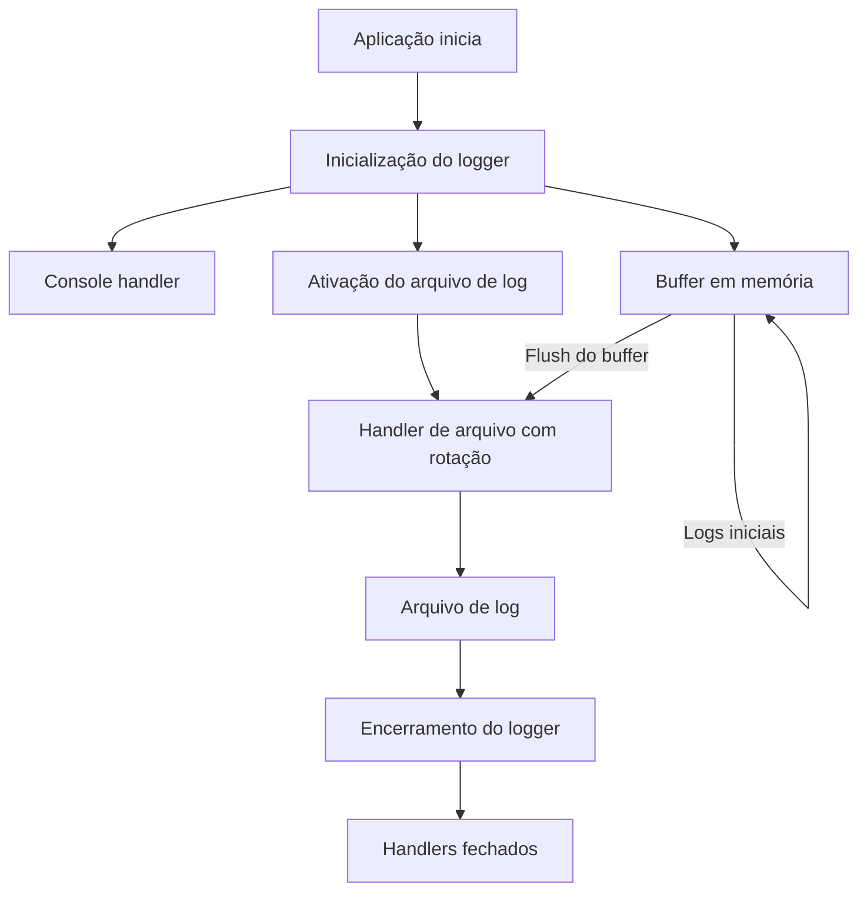

# Logger – NiceGUI App Template

Este documento descreve o módulo de logging do **NiceGUI App Template**, incluindo
objetivos, arquitetura, fluxo de execução e boas práticas de uso.

O logger foi projetado para ser **robusto, didático e previsível**, mesmo para
desenvolvedores iniciantes.

---

## Objetivos do Logger

O módulo de logger resolve problemas comuns encontrados em aplicações desktop e web:

- Registrar logs desde o início da execução do aplicativo
- Evitar perda de mensagens antes do arquivo de log existir
- Centralizar logs em um único logger raiz
- Evitar duplicação de handlers (idempotência)
- Evitar arquivos de log bloqueados no Windows
- Facilitar diagnóstico com logs internos em nível DEBUG
- Ser fácil de testar com pytest, sem flakiness

---

## Conceitos Importantes

### Logger Raiz do Aplicativo

- Existe **um único logger raiz**, definido por `LogConfig.name`
- Todos os módulos usam loggers filhos (`get_logger(__name__)`)
- Loggers filhos **propagam** mensagens para o logger raiz
- O logger raiz **não propaga** para o root logger do Python

Isso evita:

- Logs duplicados
- Interferência com logging global de bibliotecas externas

---

### Buffer em Memória

Antes do arquivo de log estar disponível, as mensagens são armazenadas em memória.

Motivo:

- Muitas aplicações só sabem o caminho do log após carregar configurações
- Sem buffer, logs iniciais seriam perdidos

Quando o arquivo é habilitado:

- O buffer é descarregado no arquivo
- O handler de buffer é removido

---

### Idempotência

Idempotência significa que **chamar a mesma função várias vezes não muda o resultado final**.

No logger:

- `bootstrap` não adiciona handlers duplicados
- `enable_file_logging` não cria múltiplos handlers de arquivo
- Isso evita logs repetidos e crescimento descontrolado do arquivo

---

### Flakiness

Flakiness ocorre quando testes:

- Passam às vezes
- Falham às vezes, sem mudança no código

Causas comuns em logging:

- Buffer não descarregado antes da leitura
- Rotação de arquivo
- Locks de arquivo no Windows

Mitigações aplicadas:

- Flush explícito nos handlers
- Shutdown garantido
- Leitura de arquivos rotacionados (`.log`, `.log.1`, `.log.2`) nos testes

---

## Fluxo de Execução do Logger

### Visão Geral



---

### Passo a Passo

#### 1. Inicialização do logger

- Define nível do logger raiz
- Anexa buffer em memória
- Anexa console (se habilitado)
- Registra logs internos em DEBUG:

  - `Logger bootstrap started`
  - `Logger bootstrap completed`

#### 2. Ativação do arquivo de log

- Garante que a inicialização já ocorreu
- Cria handler de arquivo com rotação
- Faz flush do buffer em memória
- Remove o handler de buffer
- Registra logs internos em DEBUG:

  - `Enabling file logging`
  - `File handler attached`
  - `File logging enabled: <path>`

#### 3. Encerramento do logger

- Registra início do encerramento
- Faz flush explícito
- Fecha handlers de memória e arquivo
- Registra finalização:

  - `Logger shutdown completed`

A mensagem **“shutdown completed” é emitida antes de fechar o arquivo**, garantindo
que ela apareça no log.

---

## Logs Internos de DEBUG

O próprio módulo de logger gera mensagens em nível DEBUG para facilitar diagnóstico.

Exemplos:

- `Logger bootstrap started`
- `Console handler attached`
- `Flushing memory buffer to file`
- `Closing file handler`
- `Logger shutdown completed`

Essas mensagens:

- Só aparecem quando `LogConfig.level = logging.DEBUG`
- São usadas principalmente para troubleshooting e testes

---

## Uso Básico no Aplicativo

```python
from pathlib import Path
import logging

from nicegui_app_template.core.logger import LogConfig, create_bootstrapper, get_logger

config = LogConfig(
    name="nicegui_app_template",
    level=logging.DEBUG,
    file_path=Path("logs/app.log"),
)

bootstrapper = create_bootstrapper(config)
bootstrapper.bootstrap()

log = get_logger()
log.info("Application started")

bootstrapper.enable_file_logging()

log.debug("This will appear in the log file")

bootstrapper.shutdown()
```

---

## Boas Práticas

- Chame `bootstrap` o mais cedo possível
- Ative o arquivo de log assim que o caminho estiver disponível
- Chame `shutdown` ao encerrar o app (ou registre em evento de shutdown)
- Use `get_logger(__name__)` nos módulos
- Use `get_logger()` apenas no ponto de entrada principal

---

## Testes Automatizados

O logger possui cobertura de testes para:

- Propagação correta de loggers
- Buffer em memória
- Idempotência
- Rotação de arquivos
- Logs internos de DEBUG
- Shutdown seguro no Windows

Esses testes evitam regressões silenciosas e garantem previsibilidade.

---

## Conclusão

Este logger foi projetado para:

- Ser compreensível por iniciantes
- Ser confiável em produção
- Ser testável sem hacks
- Ser seguro em ambientes Windows

Ele pode ser usado como base para aplicações NiceGUI maiores
ou como referência didática para aprendizado de logging em Python.
