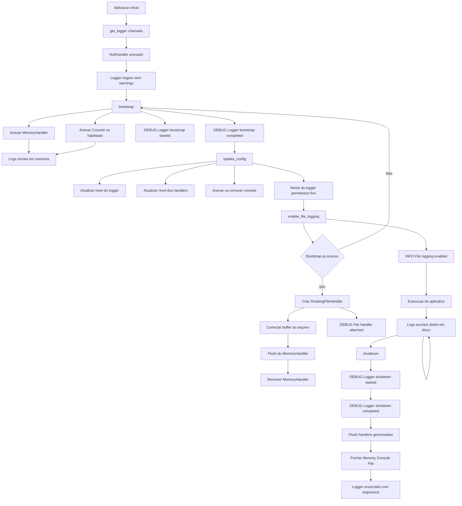

# Logger – NiceGUI App Template

Este documento descreve o módulo de logging do **NiceGUI App Template**, incluindo
objetivos, arquitetura, lifecycle, fluxo de execução, contratos explícitos e boas práticas de uso.

O logger foi projetado para ser **robusto, previsível, didático e totalmente testável**,
atendendo tanto iniciantes quanto aplicações de longo prazo em produção.

## 🎯 Objetivos do Logger

O módulo de logger resolve problemas comuns encontrados em aplicações desktop e web:

- Registrar logs desde o início da execução do aplicativo (**early logging**)
- Evitar perda de mensagens antes do arquivo de log existir
- Centralizar logs em um único logger raiz
- Garantir **idempotência** (sem duplicação de handlers)
- Evitar arquivos de log bloqueados no Windows
- Facilitar diagnóstico com logs internos em nível DEBUG
- Permitir reconfiguração segura após leitura de settings
- Ser fácil de testar com pytest, sem flakiness
- Ter lifecycle explícito e previsível

## 🧠 Conceitos Importantes

### Logger Raiz do Aplicativo

- Existe **um único logger raiz**, definido por `LogConfig.name`
- Todos os módulos utilizam **loggers filhos** (`get_logger(__name__)`)
- Loggers filhos **propagam mensagens** para o logger raiz
- O logger raiz **não propaga** para o root logger global do Python

Isso evita:

- Logs duplicados
- Interferência com bibliotecas externas
- Dependência de `logging.basicConfig()`

Este contrato é **validado por testes automatizados**.

### 🛡️ Segurança Antes do Bootstrap (NullHandler)

Antes da inicialização do logger:

- `get_logger()` pode ser chamado com segurança
- Um `NullHandler` é anexado automaticamente
- Nenhum warning do módulo `logging` é emitido
- O logger raiz não propaga para o root logger global

Isso garante que chamadas de logging **nunca quebram o aplicativo**, mesmo antes
do bootstrap.

### 📦 Buffer em Memória (Early Logging)

Antes do arquivo de log estar disponível, mensagens são armazenadas em memória
por meio de um `MemoryHandler`.

Motivação:

- O caminho do log geralmente depende de settings carregados depois
- Sem buffer, logs iniciais seriam perdidos

Quando o arquivo é ativado:

- O buffer é descarregado no arquivo
- O handler de buffer é removido
- O logger passa a escrever diretamente em disco

Comportamento **determinístico e coberto por testes**.

### 🔁 Idempotência

Idempotência significa que **chamar uma função várias vezes não altera o estado final**.

No logger:

- `bootstrap()` não duplica handlers
- `enable_file_logging()` não cria múltiplos handlers de arquivo
- `update_config()` não duplica handlers
- `shutdown()` não tenta fechar handlers inexistentes

Isso evita:

- Logs duplicados
- Crescimento descontrolado de arquivos
- Estados inconsistentes difíceis de depurar

### 🔧 Reconfiguração Controlada (`update_config`)

Após o bootstrap, o logger pode ser ajustado com segurança.

`update_config()` **faz**:

- Atualiza nível do logger raiz
- Atualiza nível dos handlers existentes
- Anexa ou remove console conforme configuração
- Mantém o nome do logger raiz imutável

`update_config()` **não faz**:

- Não cria buffer em memória
- Não ativa escrita em arquivo
- Não altera o lifecycle

Isso mantém separação clara entre:

- Inicialização
- Configuração
- Persistência

## 🔁 Lifecycle do Logger — Diagrama Detalhado por Fase



## 🐞 Logs Internos de DEBUG

O próprio módulo de logger gera mensagens internas em nível DEBUG para diagnóstico.

Exemplos:

- `Logger bootstrap started`
- `Console handler attached`
- `Enabling file logging`
- `Flushing memory buffer to file`
- `File handler attached`
- `Logger shutdown completed`

Características:

- Só aparecem quando `LogConfig.level = logging.DEBUG`
- São usadas extensivamente nos testes
- Facilitam troubleshooting sem instrumentação externa

## ▶️ Uso Básico no Aplicativo

```python
from pathlib import Path
import logging

from nicegui_app_template.core.logger import LogConfig, create_bootstrapper, get_logger

config = LogConfig(
    name="nicegui_app_template",
    level=logging.DEBUG,
    file_path=Path("logs/app.log"),
)

bootstrapper = create_bootstrapper(config)
bootstrapper.bootstrap()

log = get_logger()
log.info("Application started")

bootstrapper.enable_file_logging()

log.debug("This will appear in the log file")

bootstrapper.shutdown()
```

## ✅ Boas Práticas

- Chame `bootstrap()` o mais cedo possível
- Use `get_logger(__name__)` em todos os módulos
- Ative o arquivo de log assim que o caminho estiver disponível
- Use `update_config()` apenas após o bootstrap
- Chame `shutdown()` no encerramento do aplicativo
- Não use `logging.basicConfig()`
- Confie nos testes para validar o comportamento

## 🧪 Testes Automatizados

O módulo de logging possui cobertura extensa para:

- Segurança antes do bootstrap (`NullHandler`)
- Propagação correta de loggers filhos
- Buffer em memória e flush correto
- Idempotência do lifecycle
- Reconfiguração de console e níveis
- Defesa contra uso fora de ordem
- Rotação de arquivos
- Shutdown seguro no Windows
- Preservação de handlers externos

Esses testes reduzem regressões silenciosas e garantem previsibilidade.

## 🏁 Conclusão

Este logger foi projetado para:

- Ser compreensível por iniciantes
- Ser previsível para arquitetos
- Ser confiável em produção
- Ser testável sem hacks
- Ser seguro em ambientes Windows

Ele serve como **base sólida para aplicações NiceGUI**
e como **referência didática de logging profissional em Python**.
