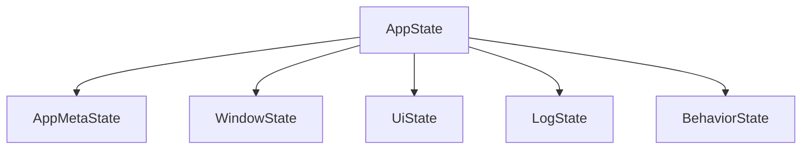
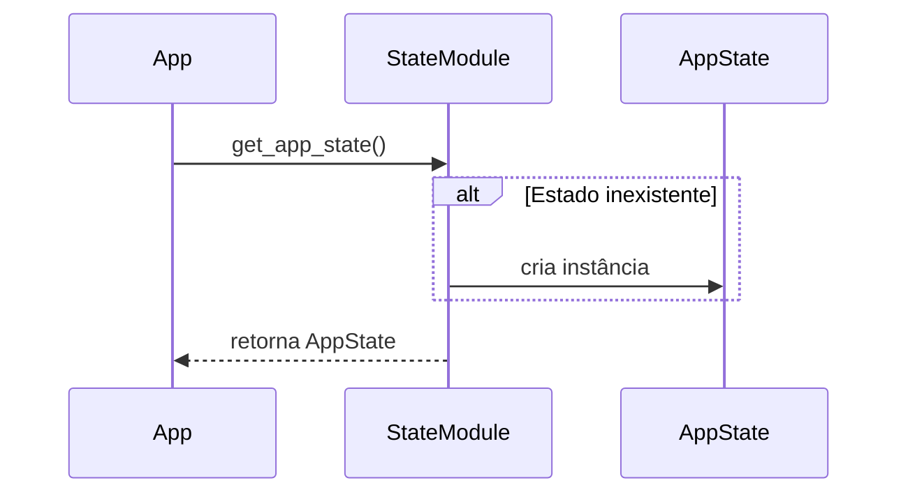

# State – NiceGUI App Template

Este documento descreve o módulo `state` do **NiceGUI App Template**, incluindo
objetivos, princípios de design, estrutura interna e regras de evolução.

O módulo de estado foi projetado para ser **simples, previsível e totalmente testável**,
servindo como a **fonte única de verdade** da aplicação em tempo de execução.

---

## 🎯 Objetivos do Módulo

O módulo `state` resolve problemas comuns em aplicações desktop e SPA:

- Centralizar dados em memória em uma estrutura única
- Evitar acoplamento entre dados, UI e infraestrutura
- Permitir inicialização previsível do aplicativo
- Facilitar testes unitários sem mocks
- Controlar evolução de campos persistentes

---

## 🧩 Princípios Fundamentais

O módulo `state` é intencionalmente **puro**.

Isso significa que ele:

- Não lê nem grava arquivos
- Não conhece TOML, JSON ou qualquer formato de serialização
- Não depende de NiceGUI, logger ou sistema operacional
- Não executa validações de entrada
- Não contém lógica de negócio

Seu papel é **representar dados em memória**, não interpretá-los.

---

## 🗂 Estrutura Geral do Estado

O estado da aplicação é dividido em **subestados coesos**, cada um responsável
por um domínio específico.



---

## 📦 Subestados

### AppMetaState

Metadados globais do aplicativo.

Responsabilidades típicas:

- Nome lógico do aplicativo
- Versão
- Idioma padrão
- Flag de primeiro uso
- Indicação de modo desktop nativo
- Porta de execução do NiceGUI

---

### WindowState

Estado persistente relacionado à janela da aplicação em modo desktop.

Campos comuns:

- Posição da janela (x, y)
- Dimensões (width, height)
- Flags de maximizado e fullscreen
- Monitor ativo
- Chave de persistência para frontend (SPA)

---

### UiState

Preferências visuais da interface.

Exemplos de campos:

- Tema (dark / light)
- Escala de fonte
- Modo de densidade reduzida
- Cor de destaque

---

### LogState

Configuração de logging em alto nível.

Características importantes:

- `path` é do tipo `Path`
- Nível e rotação são representados como strings amigáveis
- Não há parsing nem validação neste módulo

---

### BehaviorState

Flags comportamentais da aplicação.

Usado para:

- Controlar salvamento automático
- Centralizar decisões de fluxo
- Evitar flags globais espalhadas pelo código

---

## 🧠 AppState — Estado Central

A classe `AppState` agrega todos os subestados e adiciona **campos de runtime**
que **não devem ser persistidos**.

Campos de runtime incluem:

- `settings_file_path`
- `last_load_ok`
- `last_save_ok`
- `last_error`

---

## 🔁 Singleton de Estado

O módulo expõe a função:

```python
get_app_state() -> AppState
```

Essa função implementa um singleton simples e explícito, adequado para aplicações desktop.



---

## 🔗 Relação com Outros Módulos

### settings

- Lê `settings.toml`
- Faz parsing e validação leve
- Aplica valores no `AppState`
- Persiste apenas campos configuráveis

---

### UI / ViewModels

- Convertem tipos de infraestrutura para tipos editáveis
- Validam entrada
- Aplicam alterações de volta ao `AppState`

---

### Logger

- Consome dados do `LogState`
- Converte para `LogConfig`
- Gerencia handlers, níveis e rotação

---

## 📐 Regras de Evolução

Ao adicionar um novo campo persistente:

1. Adicionar o campo no subestado apropriado em `state.py`
2. Ler o campo em `settings.apply_settings_to_state`
3. Persistir o campo em `settings.build_raw_from_state`

---

## 🚫 O que Não Pertence a Este Módulo

- Lógica de UI
- Parsing de arquivos
- Validações complexas
- Variáveis de ambiente
- Dependências externas

---

## ✅ Conclusão

O módulo `state` é o núcleo de dados do aplicativo.

Ele foi projetado para ser:

- Simples
- Explícito
- Desacoplado
- Totalmente testável
- Sustentável a longo prazo
